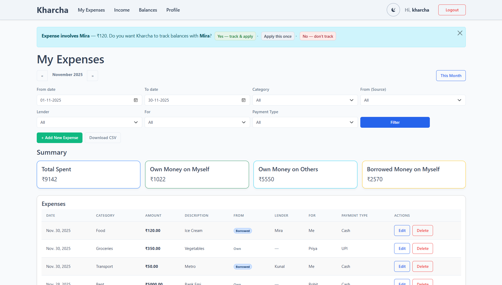
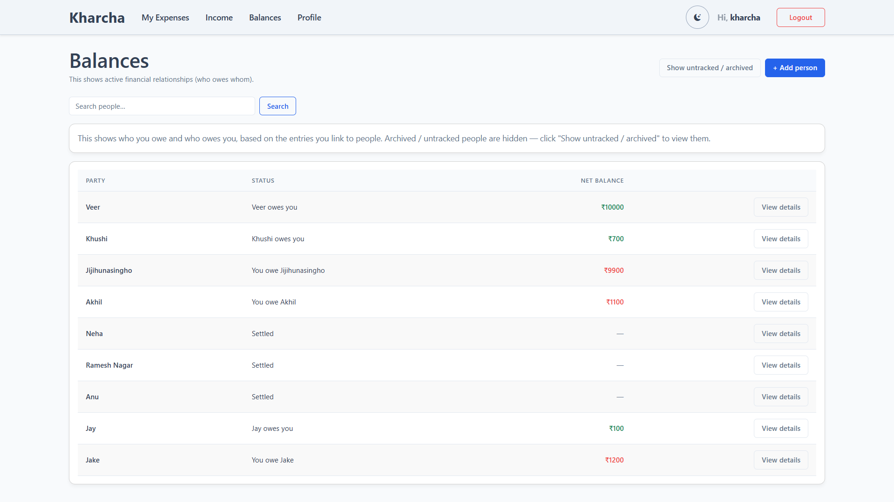

# 💰 Kharcha - Expense & Balance Tracker

Kharcha is a full-stack Django web application that helps users track expenses, income, and personal balances in a simple and practical way.  
The project focuses on clean backend logic, reliable authentication, and thoughtful handling of real-life money scenarios rather than just basic CRUD features.

🔗 **Live Demo:** https://mykharcha.onrender.com

---

### 📸 Project Preview

| **Expenses** | **Smart Balances** |
|:---:|:---:|
|  |  |


---

## ✨ Features

- **🔐 User Authentication**
  Complete authentication flow including registration, login, logout, and password reset with securely hashed passwords.

- **📧 Password Reset via Gmail API**
  Password reset emails are sent using the **Gmail API with OAuth2**, avoiding direct SMTP credentials and third-party email services.

- **👤 Guest Sandbox Mode**
  One-click guest access for trying the application without creating an account.

- **💸 Expense & Income Tracking**
  Users can add expenses and income with categories, descriptions, and dates, along with monthly navigation and filtering.

- **👥 People & Balance Tracking**
  A dedicated **People Balances** system to track money borrowed, lent, paid for others, and repayments.  
  Balances update automatically based on expenses and income, reflecting who owes whom and by how much.

- **⚖️ Smart Balance Logic**
  Supports real-world cases such as:
  - Borrowed expenses
  - Paying on behalf of someone
  - Loan repayments
  - Adjustments without double counting

- **🧹 Automated Guest Cleanup**
  Guest accounts are temporary and are periodically cleaned up through a secured maintenance process to keep the database tidy.

- **📊 Clear Monthly Summaries**
  Users can view expenses and income month-wise to better understand spending patterns.

---

## 🛠️ Tech Stack

- **Backend:** Python, Django 5.x  
- **Frontend:** HTML5, CSS3, Bootstrap 5  
- **Database:** PostgreSQL (Neon Cloud)  
- **APIs:** Google OAuth2 (Gmail API)  
- **Deployment:** Render  

---

## ⚙️ Run Locally

<details>
<summary><strong>Click to expand installation steps</strong></summary>
<br>

1.  **Clone the repository**
    ```bash
    git clone https://github.com/CDT-PRATEEK/Kharcha.git
    cd kharcha
    ```

2.  **Create a Virtual Environment**
    ```bash
    python -m venv venv
    # Windows
    venv\Scripts\activate
    # Mac/Linux
    source venv/bin/activate
    ```

3.  **Install Dependencies**
    ```bash
    pip install -r requirements.txt
    ```

4.  **Set up Environment Variables**
    Create a `.env` file in the root directory and add:
    ```env
    SECRET_KEY=your_django_secret_key
    DEBUG=True
    # Gmail API Configuration
    EMAIL_HOST_USER=your_email@gmail.com
    GMAIL_TOKEN_JSON={"token": "..."} 
    # Cleanup Security
    CLEANUP_KEY=your_secret_cleanup_password
    ```

5.  **Run Migrations & Server**
    ```bash
    python manage.py migrate
    python manage.py runserver
    ```
</details>

<br>


## 🛡️ Automated Maintenance

To keep the database efficient while allowing public access, the system implements a **Self-Healing Maintenance Strategy**:

1.  **Scheduled Trigger:** An external Cron service initiates a maintenance cycle every 24 hours.
2.  **Secure Handshake:** The request targets a protected maintenance endpoint, validated via a server-side secret key (bypassing standard session auth).
3.  **Data Policy:** The system identifies and strictly purges "Guest" accounts that have exceeded the 7-day retention period.


### 👨‍💻 Author

**Prateek Sinha**